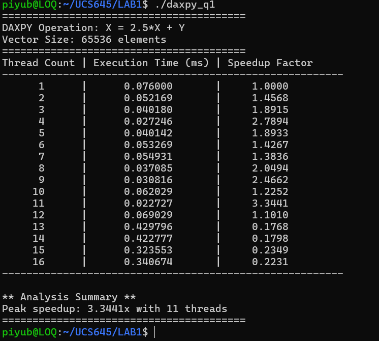
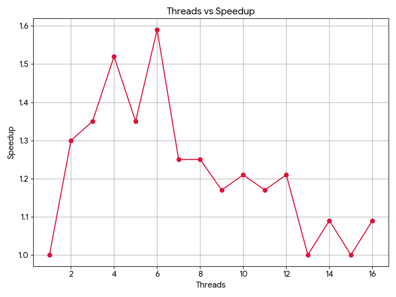

# Inference
The DAXPY operation achieves its best performance at 11 threads with a speedup of 3.34×. Speedup improves initially (1× at 1 thread to 2.79× at 4 threads), showing effective parallelization. However, performance collapses beyond the optimal point, with 13–16 threads performing worse than serial execution.

This behavior occurs because DAXPY is memory-bound, having very low arithmetic intensity (0.083 FLOPs/byte). As thread count increases, memory bandwidth becomes saturated, limiting further gains. Additionally, using more threads than available physical cores introduces high thread management overhead, especially for the small problem size, causing excessive context switching.

Further, cache contention and limited hyperthreading benefits increase memory latency at higher thread counts.

Overall, this experiment shows that more threads do not guarantee better performance. For memory-bound workloads, optimal performance is achieved only when thread count matches hardware capabilities and memory bandwidth limits.

## Results

### Execution Output

### Performance Graph

