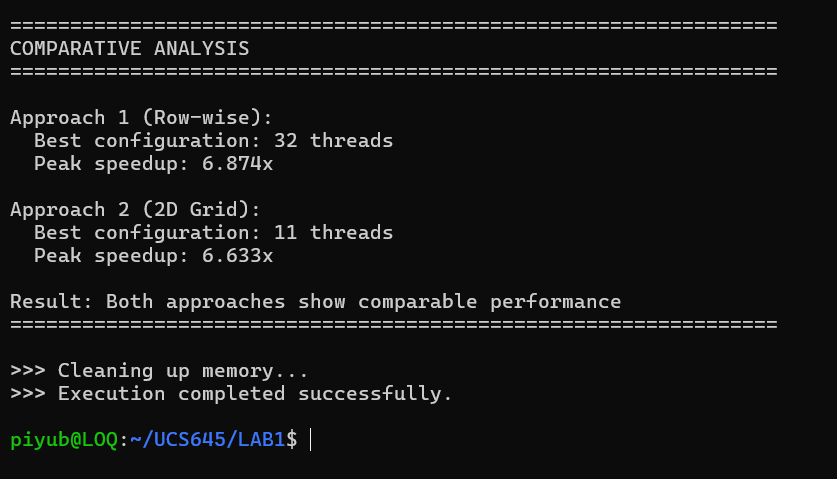
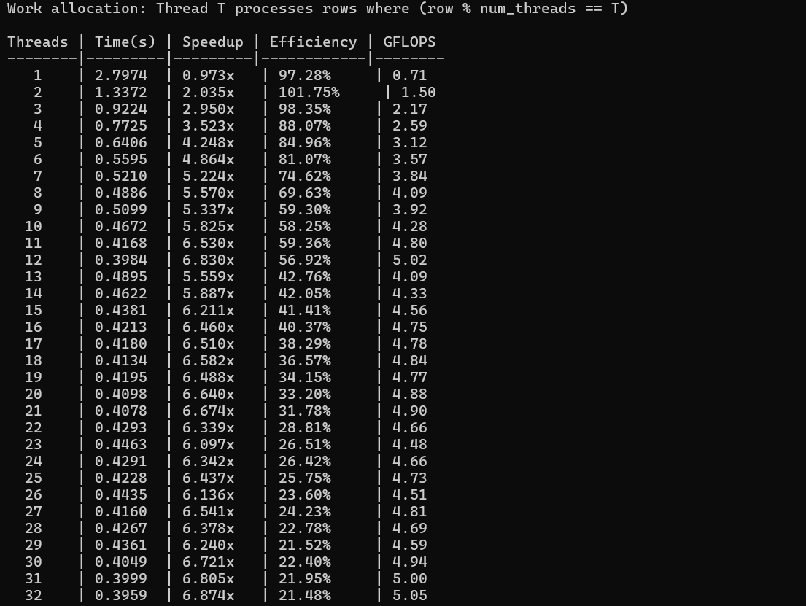
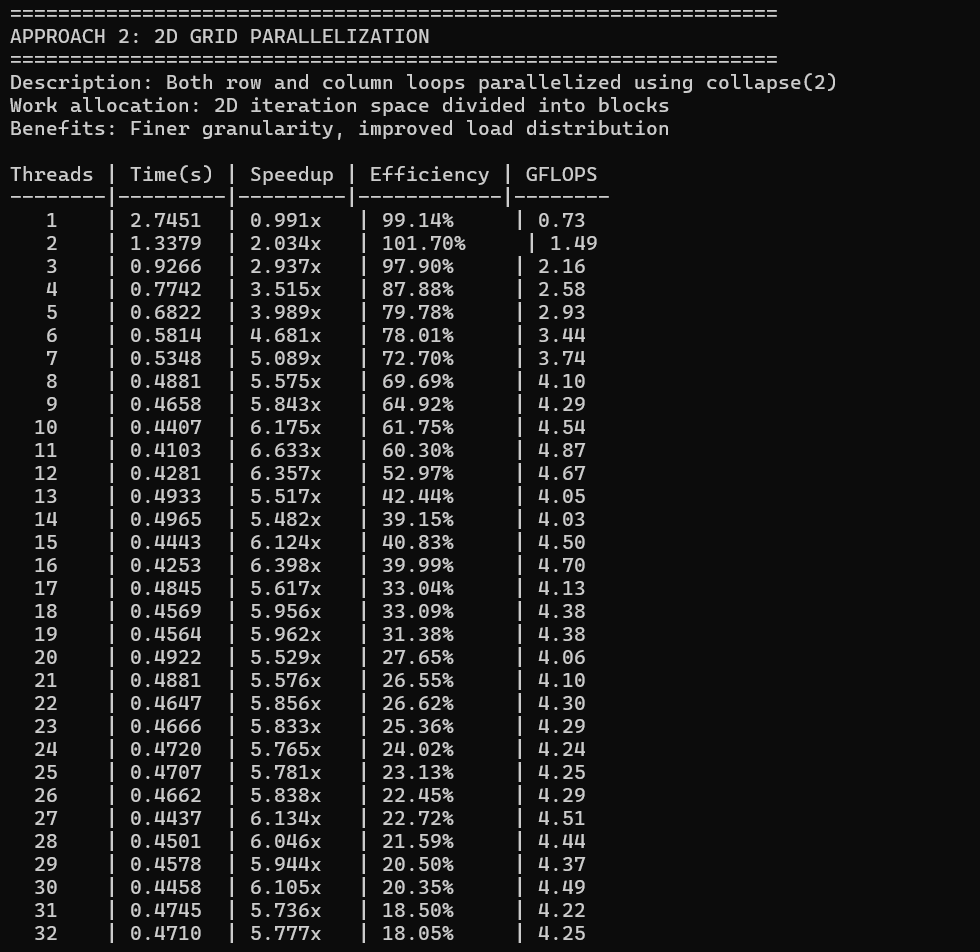
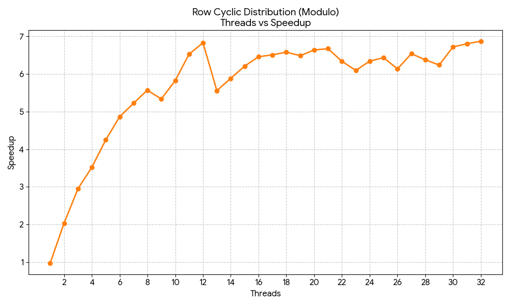

# Inference
The matrix multiplication results show that both approaches scale well due to the compute-bound nature of the workload. Approach 1 (Row-wise) reaches peak performance at 32 threads with a 6.874× speedup, while Approach 2 (2D Grid) peaks earlier at 11 threads with a 6.633× speedup. Overall performance is comparable, confirming effective parallelization.

The Row-wise approach assigns full rows to threads, resulting in coarse-grained parallelism with low scheduling overhead. This allows continued scaling up to 32 threads, although efficiency drops beyond physical core limits. In contrast, the 2D Grid approach uses finer-grained parallelism via collapse(2), improving load balance but introducing higher scheduling overhead, causing earlier saturation.

In practice, the Row-wise method offers simpler implementation and slightly better scalability, while the 2D approach is more overhead-sensitive. Both significantly outperform serial execution (~6.7× speedup), validating parallelization for compute-intensive workloads.
## Results

### Execution Output

### Performance Graph

