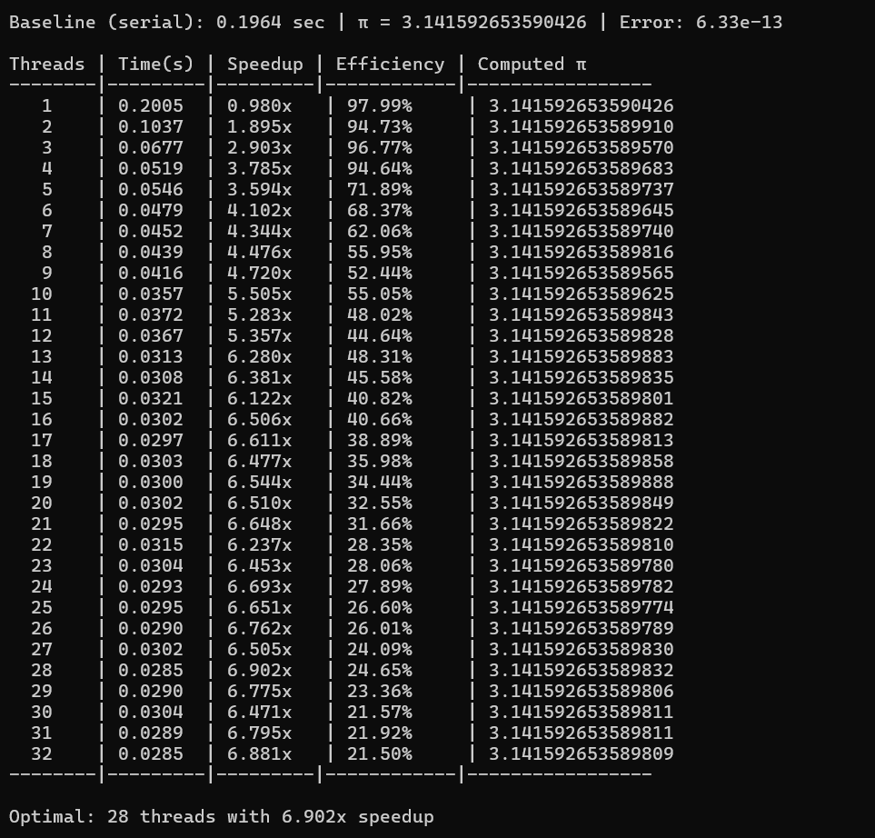
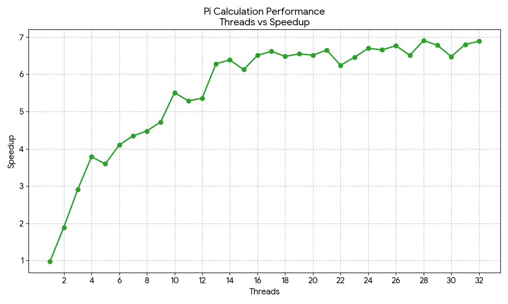

# Inference
The pi calculation scales efficiently, reaching a peak speedup of 6.902× at 28 threads. Performance improves steadily beyond physical cores, with a slight drop at 32 threads due to thread management overhead.

The code uses a private variable for each thread (local_total), allowing independent computation and only one critical section per thread. This design minimizes synchronization overhead while maintaining numerical accuracy.

Because the workload is compute-bound, thread oversubscription remains effective. The results confirm that private thread variables with minimal synchronization deliver strong parallel performance.
## Results

### Execution Output

### Performance Graph

