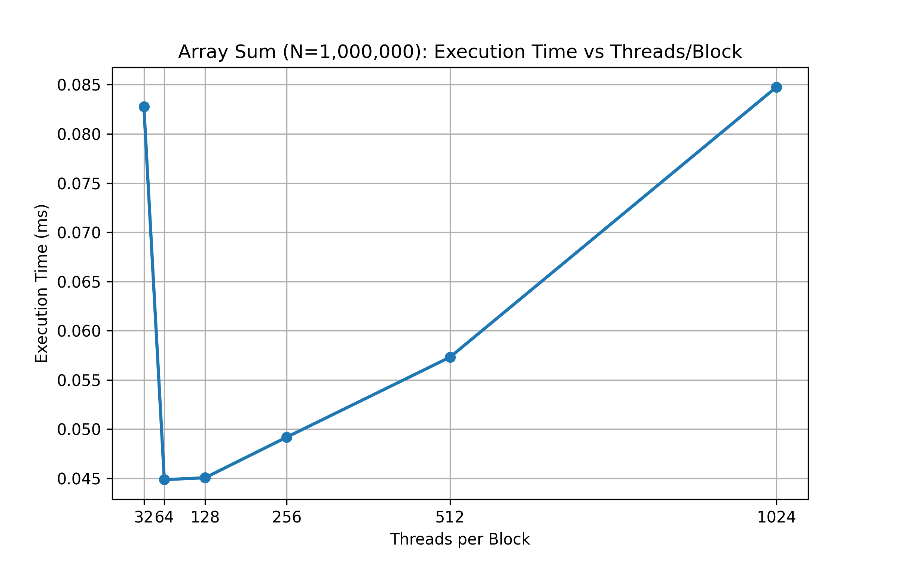
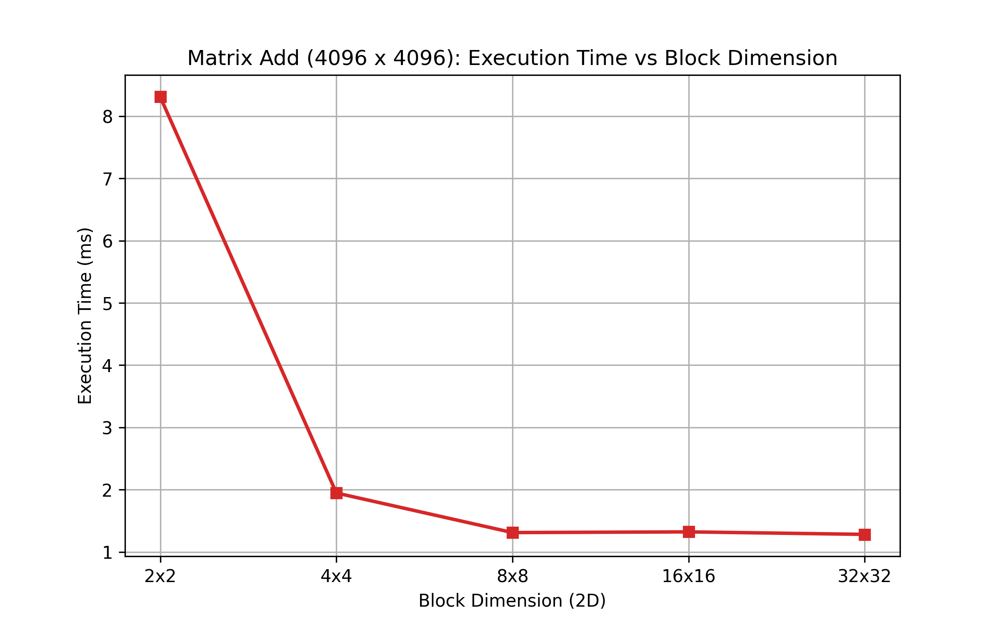

# My Lab Report: Introduction to CUDA (LAB 6)

## Part A: Device Query Report
**What I wanted to do**: I wrote a CUDA program called `device_query.cu` to actively probe my machine's GPU and figure out exactly what kind of hardware I'm working with. This let me answer all the theoretical questions based on my actual hardware!

### My Hardware Specs & Answers
1. **Architecture and Compute Capability**:
   - My GPU is an **NVIDIA GeForce RTX 4050 Laptop GPU**, which uses the newer **Ada Lovelace** architecture.
   - Its compute capability is **8.9**.

2. **Maximum Block Dimensions**:
   - The absolute maximum dimensions I can set for a single thread block (x, y, z) are **(1024, 1024, 64)**.

3. **Maximum Threads (1D Grid & Block)**:
   - If my max grid dimension is 65,535 and max block dimension is 512, then:
   - Maximum Threads = 65,535 × 512 = **33,553,920 threads**.

4. **Why wouldn't I want to launch the maximum number of threads?**
   - **Running out of registers or shared memory**: If my kernel needs a ton of registers or shared memory, launching max threads will completely overwhelm the Streaming Multiprocessor (SM). This either causes the launch to fail or hurts performance by destroying occupancy.
   - **Small Data**: If my array only has 1,000 elements, launching 33 million threads is just wasting GPU scheduling time!
   - **Memory Bottlenecks**: Firing off maximum threads might cause too many simultaneous memory requests, clogging up the memory bus and causing massive latency.

5. **What limits my program from launching max threads?**
   - **Hardware Limits**: There's a hard cap of 1024 threads per block.
   - **Register Limits**: My SM only has so many 32-bit registers (usually 65,536). If each thread uses too many, I can't fit max threads on the SM.
   - **Shared Memory Limits**: If my block asks for more shared memory than the SM physically has (e.g., more than 48KB/100KB), the kernel launch will just fail.

6. **What is Shared Memory and how much do I have?**
   - **Shared Memory** is incredibly fast, user-managed memory that is shared by all threads inside the *same* block. It's basically a programmable L1 cache that I can use to prevent threads from constantly hitting the slow global memory.
   - On my RTX 4050, the shared memory per block is **49,152 bytes (48 KB)**.

7. **What is Global Memory and how much do I have?**
   - **Global Memory** is the main VRAM on the graphics card. It's huge and accessible by *all* threads and blocks, plus the CPU can read/write to it. The catch? It's the slowest memory to access.
   - My RTX 4050 has **6,053,232,640 bytes (~6 GB)** of global memory.

8. **What is Constant Memory and how much do I have?**
   - **Constant Memory** is special read-only memory. It's incredibly fast *if* all threads in a warp are reading the exact same address at the exact same time because it broadcasts the value.
   - My GPU has **65,536 bytes (64 KB)** of constant memory.

9. **What is Warp Size?**
   - **Warp Size** is the fundamental execution unit in CUDA. The GPU groups threads into "warps", and all threads in a warp execute the exact same instruction at the exact same time (SIMT). 
   - The warp size on my GPU (and all modern NVIDIA GPUs) is **32 threads**.

10. **Is double precision supported?**
    - **Yes!** Any GPU with compute capability 1.3 or higher supports double precision (`FP64`). Since my GPU is CC 8.9, it definitely supports it.

---

## Part B: Array Sum Reduction
**What I wanted to do**: I wrote `array_sum.cu` to sum up an array of 1,000,000 floating-point numbers. To make it super fast, I implemented a **Parallel Reduction** algorithm that uses shared memory to sum elements within each block before bringing them back to the CPU. I also profiled the execution time across different block sizes!

| Threads per Block | Blocks per Grid | Execution Time (ms) |
| :--- | :--- | :--- |
| 32 | 31,250 | 0.082784 |
| 64 | 15,625 | 0.044864 |
| 128 | 7,813 | 0.045056 |
| 256 | 3,907 | 0.049184 |
| 512 | 1,954 | 0.057312 |
| 1024 | 977 | 0.084768 |

### My Thoughts & Takeaways
- **The Sweet Spot**: Looking at the graph, the execution time drops sharply as I increase the block size from 32 to 64/128 threads, hitting a sweet spot around `0.044 ms`. 
- **Too Many Threads**: Interestingly, pushing it to the maximum 1024 threads per block actually made it slower (`0.084 ms`)! This is a perfect real-world example of my answer to Question 4—using maximum threads per block limits how many blocks the SM can actively schedule at once due to shared memory and register constraints, hurting overall occupancy.
- **What I Learned**: Just because my GPU *can* run 1024 threads per block doesn't mean I should. A block size of 128 or 256 is almost always the safest and most efficient bet for simple reduction kernels!

---

## Part C: Matrix Addition
**What I wanted to do**: I wrote `matrix_add.cu` to perform 2D element-wise integer addition on two massive matrices. To find the most optimal configuration, I profiled it across different 2D block dimensions!

| Block Dim (2D) | Grid Dim (2D) | Execution Time (ms) |
| :--- | :--- | :--- |
| 2 x 2 | 2048 x 2048 | 8.309696 |
| 4 x 4 | 1024 x 1024 | 1.946624 |
| 8 x 8 | 512 x 512 | 1.310720 |
| 16 x 16 | 256 x 256 | 1.321984 |
| 32 x 32 | 128 x 128 | 1.281760 |

### Operations Analysis (for a 4096 x 4096 Matrix)
1. **How many operations are being performed?**
   - I am doing exactly 1 integer addition per matrix element.
   - 4096 × 4096 = **16,777,216 total additions**.
2. **How many global memory reads are being performed?**
   - The kernel has to read `A[i][j]` and `B[i][j]` from global memory.
   - 16,777,216 elements × 2 reads = **33,554,432 total reads**.
3. **How many global memory writes are being performed?**
   - The kernel writes the answer to `C[i][j]`.
   - **16,777,216 total writes**.

### My Thoughts & Takeaways
- **The Cost of Tiny Blocks**: Using a `2x2` block size was disastrously slow (`8.3 ms`). A `2x2` block only contains 4 threads. Since the GPU executes instructions in warps of 32 threads, launching a block of 4 threads means the SM is essentially wasting the other 28 threads in the warp. This completely destroyed my hardware utilization.
- **Warp Alignment is Everything**: As soon as I scaled up to `8x8` (which is 64 threads, or exactly 2 warps), the time plummeted to `1.3 ms`. 
- **What I Learned**: When doing 2D grid setups, I always need to make sure `blockDim.x * blockDim.y` is a multiple of 32 (the warp size) to keep the GPU fully fed and avoid wasting cycles!
